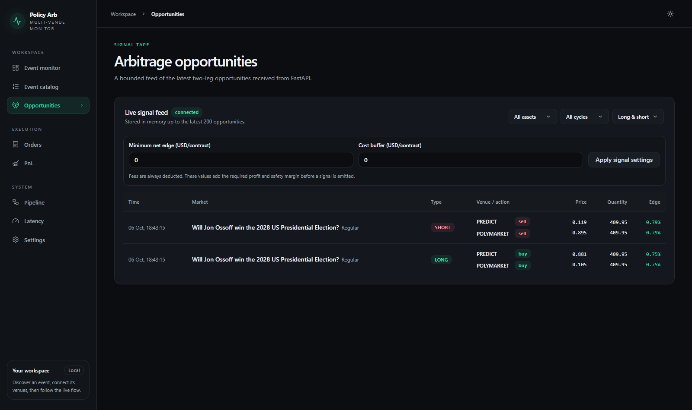
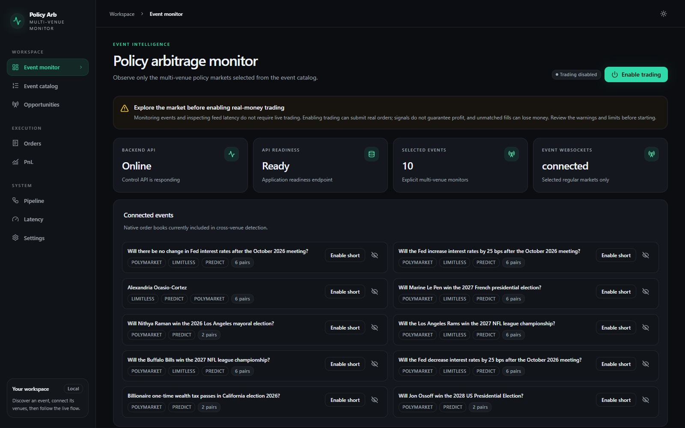
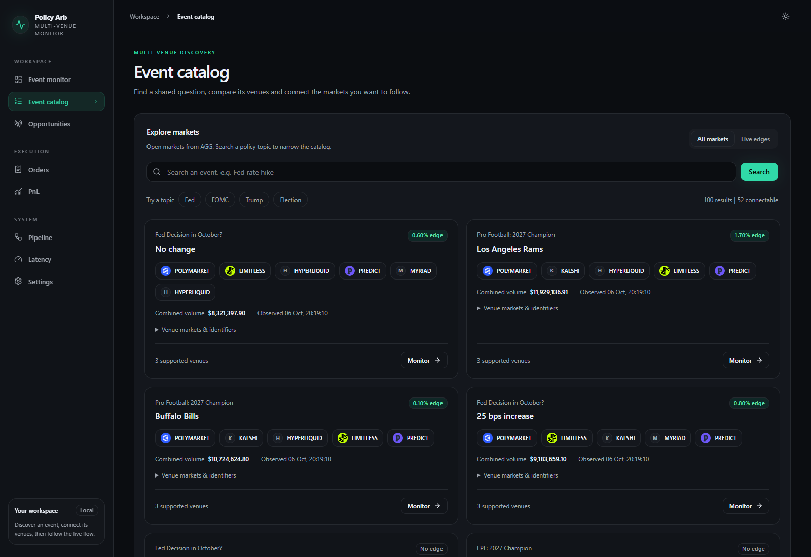
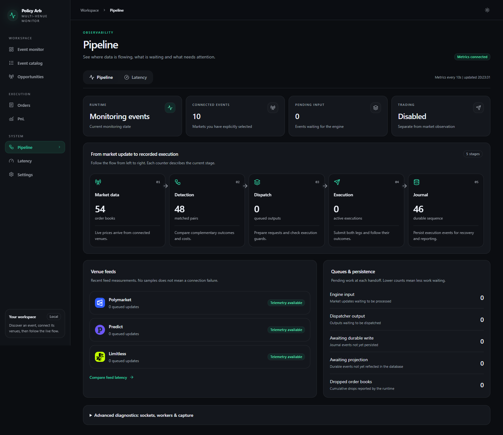
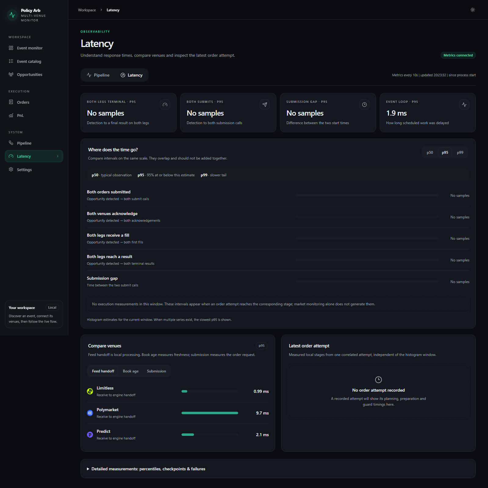
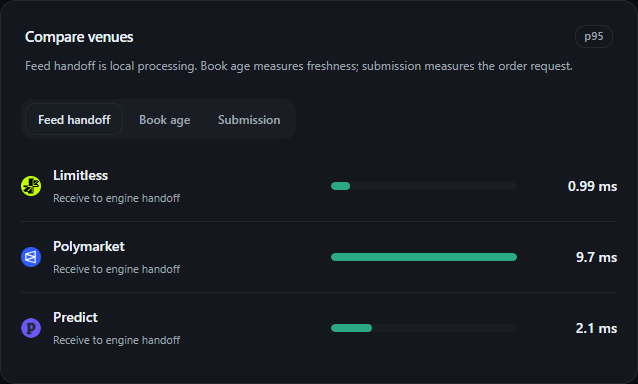
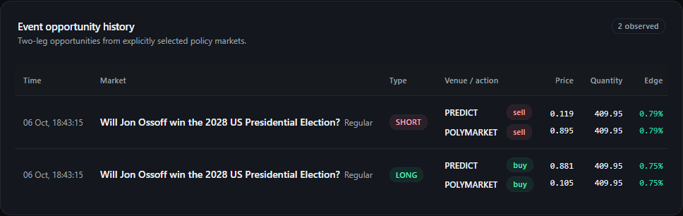
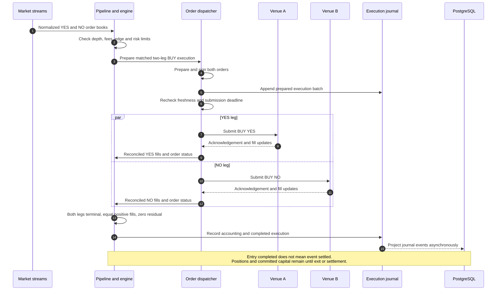
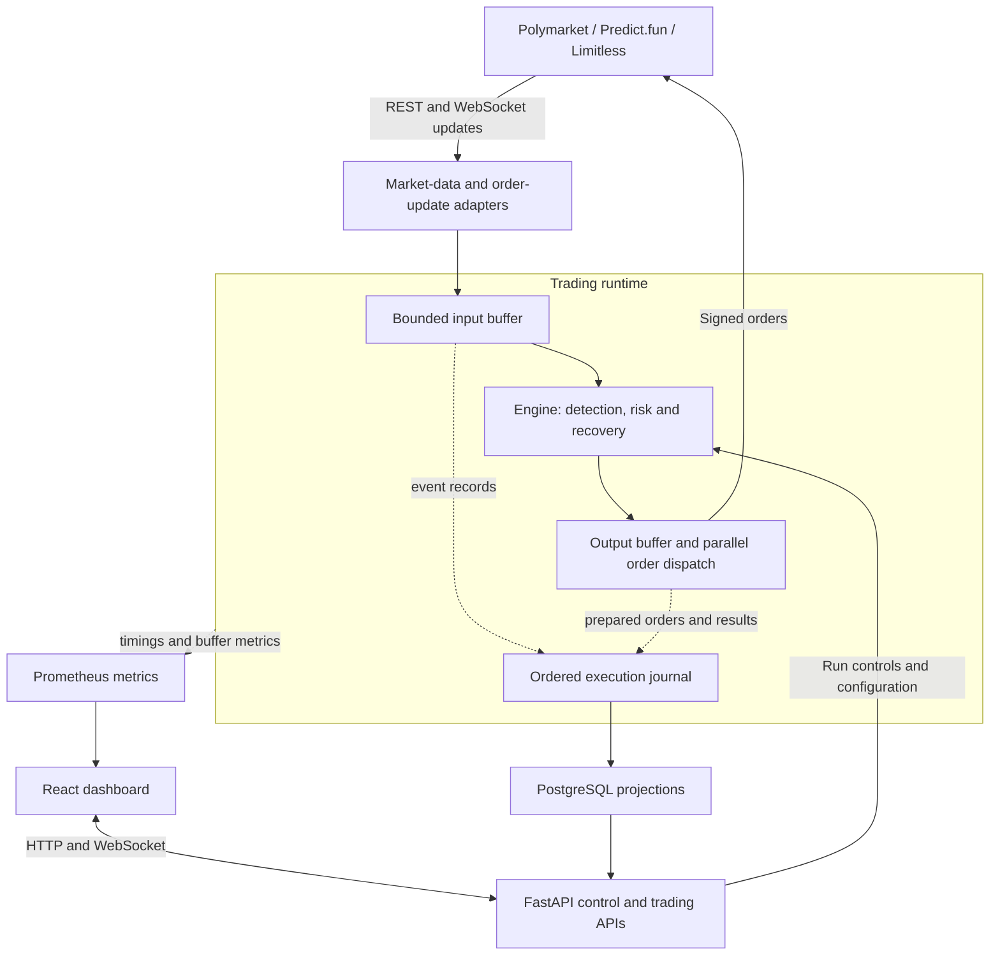

# Multi-venue Arbitrage for Political Events

[](https://github.com/rafaayud/multivenue_arbitrage_prediction_markets/actions/workflows/ci.yml)

A modular, event-driven prediction-market arbitrage engine with an
**LMAX-inspired processing pipeline**, built with **FastAPI and React**.

Detect and execute two-leg opportunities across **Polymarket, Predict.fun and
Limitless**, with an operations dashboard for signals, execution, recovery and
PnL.

This repository focuses on **political and policy events**, including central-bank
interest-rate decisions. It combines a Python backend, domain models and
ports-and-adapters boundaries with venue-specific market data and execution.

> This is a small-scale trading project and an engineering portfolio, not a
> guarantee of profit or a production-readiness claim. The application can submit
> real orders and on-chain transactions.

## Application screenshots

Captured from the local Docker application on **6 October 2026**, with
**trading disabled**. The monitor, catalog, pipeline and latency views show live
data. The opportunity images reproduce the real persisted detections described
below. These are observations, not executed trades or realized profit; prices,
counts and timings describe this session only.

**Opportunities (historical replay).** The two Ossoff detections at 18:43:15,
displayed as complementary SHORT and LONG routes. The current frontend keeps
its visible signal history in memory, so the stored records were replayed into
a temporary capture browser. Their timestamps, prices, quantities and edges
come from the backend history; the replay did not send signals to the trading
engine or place orders.



**Event monitor.** Selected events, venue connections and the real-money warning.



<details>
<summary>Event catalog</summary>

AGG discovery results with venue coverage and volumes rounded to two decimals.
The catalog can list additional venues; only Polymarket, Predict.fun and Limitless
can be connected for this workflow. Catalog edges are AGG observations, separate
from the engine's fee-aware signals.



</details>

<details>
<summary>Pipeline</summary>

The five processing stages, connected feeds, queue occupancy and journal progress.
Market monitoring remains active while order execution is disabled.



</details>

<details>
<summary>Latency</summary>

The separate latency view shows percentile estimates and venue comparisons.
Execution intervals display **No samples** because no orders were submitted in
this session. Feed handoff measures local receipt-to-engine processing, not
network round-trip time or an end-to-end trading latency guarantee.



</details>

**Feed latency detail.** The same venue comparison at a readable scale.



## Supported venues and API credentials

**Live trading through this dashboard is currently limited to three venues:
Polymarket, Predict.fun and Limitless.** AGG provides market discovery and
cross-venue matches; it is not a live execution venue in this workflow. Other
venues may appear in AGG's catalog, but the dashboard only connects markets from
the three supported execution venues.

You must supply your own API access and signing credentials in `.env`:

| Service | Configuration |
| --- | --- |
| **AGG** | `AGG_APP_ID` for the dashboard catalog. Authenticated AGG adapters additionally require `AGG_APP_API_KEY` or `AGG_ADMIN_KEY`. |
| **Predict.fun** | `PREDICT_API_KEY`, `PREDICT_ACCOUNT_ADDRESS` and `PREDICT_PRIVY_PRIVATE_KEY`. |
| **Polymarket** | `POLYMARKET_API_KEY`, `POLYMARKET_API_SECRET`, `POLYMARKET_PASSPHRASE`, `POLYMARKET_PK` and `POLYMARKET_FUNDER`; configure `POLYMARKET_SIGNATURE_TYPE` for your wallet. |
| **Limitless** | `LIMITLESS_API_KEY` and `LIMITLESS_PRIVATE_KEY`. |

The current live-trading preflight requires credentials for **all three execution
venues**, even when the selected event uses only two. See [`.env.example`](.env.example)
for additional settings, including RPC and relayer configuration for inventory
operations. No API keys or funded accounts are bundled with the project.

## Before using real funds

**Running locally does not make this a simulation.** With funded venue accounts
and live trading enabled, the application can submit real orders and on-chain
transactions. Do not fund accounts solely to obtain screenshots or latency data.

- Connect events with trading disabled to inspect market data, detected signals
  and feed latency. Submission, acknowledgement and fill timings require actual
  order attempts and may remain empty during observation.
- A signal is an observed price discrepancy, not guaranteed profit. One leg may
  fill while the other fails, and fees, slippage or recovery can produce losses.
- Check contract resolution rules on both venues. Capital may remain committed
  until settlement, and stopping the worker does not automatically close positions.
- Review balances, collateral approvals and per-venue limits before enabling
  trading. The configured recovery-loss limit is not a guarantee on total losses.

The dashboard displays these risks before live startup and requires an explicit
risk acknowledgement in addition to the trading key and valid run limits. This
confirmation also applies when overriding degraded venue-health checks.

## Why political and policy events?

In our live use, these events have been easier to execute on both legs than the
other markets we tried. That practical experience motivated this dashboard's
focus on explicitly selected events rather than continuously rotating markets.

This is an operator observation, not a controlled comparison or a measured
fill-rate claim. A visible price discrepancy still does not guarantee that both
orders will fill, even when they are submitted in parallel.

## Strategy

The main workflow buys complementary outcomes of equivalent binary markets:

- BUY YES on venue A.
- BUY NO on venue B, for the same proposition and matched quantity.

For a pair whose combined settlement payout is one unit, the per-contract entry
condition is:

```text
1 - executable YES cost - executable NO cost - fees - cost buffer > minimum edge
```

The detector uses available depth, tick sizes, fee models and book timing; the
execution path applies additional sizing, admission and freshness checks. A
top-of-book discrepancy is not enough if the required quantity is unavailable.

The shared engine also implements covered SELL arbitrage, with inventory
preparation for selected markets. Selling requires existing outcome tokens; it
is not uncollateralized short selling. The live-testing scope described below
applies to BUY trades, not to every strategy the code supports.

### Preparing inventory for covered SHORT trades

When you select an event for SHORT execution and enable live trading, the
runtime checks inventory on each participating venue. The current target is
**5 complete YES/NO sets per selected venue market**: for an event connected
on two venues, inventory is prepared on both. Starting without outcome tokens,
this requires splitting **5 units of each venue's collateral** into 5 YES and
5 NO tokens on that venue. These are collateral-token units, not euros
(the current adapters use pUSD on Polymarket and USDT on Predict).

This uses and locks existing funded collateral; it does not create money or
credit. Existing complete sets count toward the target, so only the deficit is
split. Selecting additional markets can require additional collateral.

For these explicitly selected regular events, the runtime **does not continuously
replenish inventory after each SHORT**. To prepare another allocation after
inventory is consumed, stop and start trading again with the desired SHORT events
selected. Startup checks balances and replenishes the deficit up to the same
5-set target; restarting does not increase that target or add an unconditional
5 units. The available inventory and execution limits determine how many trades
it can support. See the
[short inventory service](src/prediction_markets/application/execution/short_inventory.py).

### Observed signal: two views of the same opportunity

On **6 October 2026 at 18:43:15 Europe/Madrid (16:43:15 UTC)**, the dashboard
displayed the following signals for **"Will Jon Ossoff win the 2028 US Presidential
Election?"**. Both observations are persisted in the local backend's opportunity
history; these are detection records, not executed trades or realized returns.

| Displayed signal | Predict.fun leg | Polymarket leg | Observed quantity per leg | Net edge shown |
| --- | --- | --- | ---: | ---: |
| **LONG** | BUY NO at 0.881 | BUY YES at 0.105 | 409.95 | 0.75% |
| **SHORT** | SELL YES at 0.119 | SELL NO at 0.895 | 409.95 | 0.79% |

The detail below reproduces those persisted observations in the dashboard
(historical replay for the screenshot, with the original detection times).



**These two rows express the same cross-venue price discrepancy.** Predict's
YES order book also supplies the NO prices: the
[Predict adapter](src/prediction_markets/infrastructure/venues/predict/mappers.py)
complements prices and swaps sides while preserving each level's quantity:

```text
NO ask = 1 - YES bid
NO bid = 1 - YES ask

LONG gross edge  = 1 - (0.881 + 0.105) = 0.014
SHORT gross edge =     0.119 + 0.895 - 1 = 0.014
```

Here, `0.881 = 1 - 0.119`, and the observed Polymarket prices are also
complementary (`0.895 = 1 - 0.105`). Both routes therefore expose the same gross
edge of **1.4% of the unit payout**, rather than two independent sources of
profit. Do not add their edges or count their displayed quantities as independent
liquidity. The two percentages shown for the legs within each row also describe
one paired opportunity, not a separate return on each leg.

The net figures differ because the detector applies side-dependent fees: the
stored net edges are approximately **0.0075395 per pair for LONG** and
**0.0078610 per pair for SHORT**, rounded by the dashboard to 0.75% and 0.79%.
These are payout-based edges, not annualized returns or returns on committed
capital. LONG requires buying both outcomes; covered SHORT requires inventory
of both outcomes to sell. The
[engine's admission guard](src/prediction_markets/application/engine.py)
treats the complementary LONG/SHORT routes as equivalent when checking for an
already admitted execution. The history currently displays both observations.

The displayed quantity is the common top-of-book liquidity observed at detection;
execution sizing, freshness and risk checks still apply before any order.

## A completed arbitrage

The successful entry path buys complementary outcomes on two venues. The
dispatcher prepares both orders before submission, records the prepared batch
and applies the final guards. The two legs are then submitted in parallel;
acknowledgements and fill updates can arrive independently.



PostgreSQL projection runs in the background; it is not a synchronous database
commit between the two submissions. If the fills do not match, this is no longer
the completed-entry path: the execution can require recovery or manual review.

## Functionality

- **Event selection:** discover cross-venue candidates and explicitly connect
  the events to monitor. Contract resolution rules still require operator review.
- **Market data:** normalize venue books and updates behind common interfaces.
- **Execution:** prepare and sign venue-specific orders, journal execution state
  and submit the two legs concurrently.
- **Recovery:** evaluate completing the missing leg or unwinding unmatched fills,
  subject to available liquidity, fees and configured loss limits. Uncertain
  execution can remain in `needs_review` and block further trading.
- **Accounting:** track orders, fills, positions, cash movements and execution PnL.
- **Operations:** inspect signals, orders, PnL, pipeline timings and settings in
  the dashboard; expose Prometheus metrics for queue pressure and event-loop lag.

## Architecture

The project combines modular code organization, ports-and-adapters integrations
and an LMAX-inspired event-processing pipeline. These describe different aspects
of the system:

| Concept | How it applies here |
| --- | --- |
| **Modularity** | Domain rules, application processing, venue integrations, persistence and the dashboard have separate responsibilities. |
| **Ports and adapters** | Domain-owned interfaces describe venue capabilities; infrastructure adapters implement them. This follows the boundary-separation idea of [hexagonal architecture](https://alistair.cockburn.us/hexagonal-architecture). |
| **LMAX-inspired processing** | Bounded input/output rings surround an in-memory engine with sequential input processing, an ordered execution journal, replay of durable events and separate asynchronous order dispatch. This resembles the processing structure described in [The LMAX Architecture](https://martinfowler.com/articles/lmax.html). |

The implementation uses Python `asyncio` and event-loop-confined ring buffers,
not the LMAX Disruptor. Order preparation and venue I/O run in dispatcher tasks;
PostgreSQL projections run asynchronously. Application pipeline modules also
depend directly on infrastructure telemetry, so strict hexagonal dependency
isolation is not enforced across the entire application. These architectural
similarities imply no equivalent throughput or latency guarantees.

The core separates trading concepts and decisions from venue protocols. Domain
ports describe discovery, market data, fees, execution and inventory operations;
adapters translate these contracts into REST, WebSocket and SDK calls.



### Code organization

| Layer | Responsibility |
| --- | --- |
| [`domain/`](src/prediction_markets/domain/) | Contracts, order books, money and quantity values, arbitrage rules and port definitions. |
| [`application/`](src/prediction_markets/application/) | Engine state, bounded event pipeline, execution lifecycle, recovery decisions and accounting. |
| [`infrastructure/`](src/prediction_markets/infrastructure/) | Venue adapters, journal implementation, PostgreSQL persistence and telemetry. |
| [`api/`](src/prediction_markets/api/) | FastAPI endpoints, runtime composition, preflight checks and trading controls. |
| [`frontend/`](frontend/) | React, TypeScript and Vite operations dashboard. |
| [`migrations/`](migrations/) | PostgreSQL schema migrations. |
| [`tests/`](tests/) | Domain, application, adapter, API and operational regression tests. |

For a code walkthrough, start with the [arbitrage rules](src/prediction_markets/domain/arbitrage/services.py),
[execution port](src/prediction_markets/domain/ports/execution.py),
[trading engine](src/prediction_markets/application/engine.py),
[pipeline](src/prediction_markets/application/pipeline/runtime.py) and
[recovery decisions](src/prediction_markets/application/execution/recovery_decision.py).

### Execution and latency

Trading decisions operate on normalized in-memory state. Order preparation,
submission and observation are coordinated by the output dispatcher, with
parallel work for the two venues. Bounded buffers make overload observable;
they do not eliminate backpressure or make stale quotes executable.

The control API and trading runtime run as separate services. Although the
codebase supports market-data worker processes, the supplied event-dashboard
Compose configuration disables them and disables recurring-market monitoring.

Stage timings, book age, queue usage and event-loop lag are instrumented. There
is no fixed latency guarantee: feed quality, scheduling, signing and venue
responses all contribute to the execution timeline.

## Live-testing scope and limitations

### Small order sizes only

Our reported live testing has been limited to **BUY orders of up to EUR 10
equivalent per venue**. This describes the scope of our experience, not a
hard-coded EUR limit or evidence that larger orders will behave similarly.
Actual orders use each venue's quote and collateral currency.

Execution quality at larger sizes has not been established. Displayed depth,
slippage, partial fills and recovery liquidity can behave differently as size
increases. Risk limits must be configured explicitly; the dashboard does not
turn this testing scope into a universal safety guarantee.

### Capital remains committed until settlement

A fully filled pair is not immediately reusable cash. If held to settlement,
the money committed to the positions remains tied up until the event resolves
and the relevant venue settles or permits redemption. If the event is weeks or
months away, that capital may remain unavailable for other opportunities for
that entire period, potentially longer if resolution is delayed or disputed.

Exiting early requires executable liquidity and may incur fees or give up the
entry edge. A larger quoted edge is therefore not automatically better than a
smaller edge with a shorter holding period. This project does not establish an
optimal capital-allocation or annualized-return policy.

### Execution, resolution and infrastructure risks

- **No cross-venue atomicity:** one leg can fill while the other is rejected,
  partially filled or uncertain. Parallel submission reduces sequencing delay,
  not the possibility of residual exposure.
- **Recovery is conditional:** corrective orders can fail or exceed loss limits.
  Venue minimums, rounding, dust and excess fills can complicate neutralization;
  manual review may still be necessary.
- **Equivalent titles are not equivalent contracts:** deadlines, resolution
  sources, cancellation rules and exceptional outcomes must match. Different
  venue decisions can break the assumed complementary payout.
- **Separate collateral pools:** funds and tokens are venue-specific. Balances,
  approvals, settlement assets, gas and transfers affect what is executable.
  A common display unit does not remove currency or stablecoin risk.
- **Fees and market rules matter:** tick sizes, order minimums, fee schedules and
  venue order semantics can affect the achievable result. Detection is not a
  promise of realized PnL.
- **Operational dependency:** stale feeds, API limits, disconnections, uncertain
  acknowledgements and process overload can prevent safe execution.
- **Current preflight is broad:** live trading checks credentials for all three
  execution venues, as well as database readiness and unresolved executions.
  Selecting fewer markets does not currently narrow that credential check.

## Run locally

Requirements: Docker with Compose v2. For development outside Docker, use Python
3.13, `uv`, Node.js 22 and pnpm 11.

1. Create `.env` from `.env.example` **only if you do not already have one**:

   ```powershell
   if (-not (Test-Path .env)) { Copy-Item .env.example .env }
   ```

2. Configure the [API credentials](#supported-venues-and-api-credentials) above
   and a nonempty `TRADING_API_KEY`. Keep
   signing keys and API secrets out of `VITE_*` variables, which are public
   frontend configuration. Compose supplies the local database connection.
3. Build and start the services:

   ```sh
   docker compose up --build -d
   ```

4. Open the [dashboard](http://localhost:8080), inspect connected events and
   configure risk limits before explicitly enabling trading. The example
   environment is not a funded demo account.

The [API documentation](http://localhost:8000/docs) and
[Prometheus](http://localhost:9090) are also exposed locally. Ports bind to
loopback; PostgreSQL, journal and metrics data use Compose-managed volumes.
Another stack using the same ports will conflict. The optional `alerting`
profile requires its own receiver configuration and secrets.

Stop services without deleting their volumes:

```sh
docker compose down
```

## Tests and CI

The [GitHub Actions workflow](.github/workflows/ci.yml) runs on pushes to `main`,
pull requests and manual dispatch. It has two independent jobs:

- **Backend:** install Python 3.13 dependencies from `uv.lock`, then run pytest
  excluding tests marked `integration`.
- **Frontend:** install Node.js 22 and pnpm 11 dependencies from the lockfile,
  then run TypeScript checks, Vitest tests and a production Vite build.

CI has read-only repository permissions. It does not use trading credentials,
submit orders, publish Docker images or deploy services. A green run checks the
covered software behavior, not live fills, profitability or settlement safety.

The badge at the top links to the workflow runs and displays GitHub's reported
status for `main`; it is not a static passing label.

Run the corresponding checks locally:

```sh
uv sync --frozen --group dev
uv run pytest tests -m "not integration"

cd frontend
corepack pnpm install --frozen-lockfile
corepack pnpm typecheck
corepack pnpm test
corepack pnpm build
```

Integration tests contact external services and are excluded above. Local
diagnostic scripts under `repo_tools/` are intentionally untracked and are not
required to build or run the application. Tests requiring those optional scripts
skip when they are absent; the remaining runtime tests still run.

## Repository scope and attribution

This repository is a portfolio snapshot of the two-leg cross-venue event
arbitrage workflow. Other adapters remain as reusable infrastructure, but this
dashboard is focused on selected political and policy events rather than the
separate three-outcome sports strategy.

Private environment files, operational reports, trade data and cloud deployment
configuration are not part of the distributed application. Do not commit keys,
account exports or live journals. Contributor attribution is retained in
[`pyproject.toml`](pyproject.toml).
