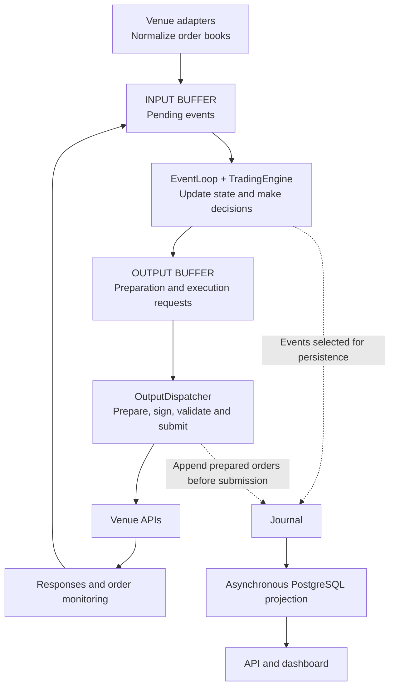

# Trading pipeline

```mermaid
flowchart TD
    A["Venue adapters<br/>Normalize order books"] --> B["INPUT BUFFER<br/>Pending events"]
    B --> C["EventLoop + TradingEngine<br/>Update state and make decisions"]
    C --> D["OUTPUT BUFFER<br/>Preparation and execution requests"]
    D --> E["OutputDispatcher<br/>Prepare, sign, validate and submit"]
    E --> F["Venue APIs"]
    F --> G["Responses and order monitoring"]
    G --> B

    C -. "Events selected for persistence" .-> J["Journal"]
    E -. "Append prepared orders before submission" .-> J
    J --> P["Asynchronous PostgreSQL projection"]
    P --> U["API and dashboard"]
```
